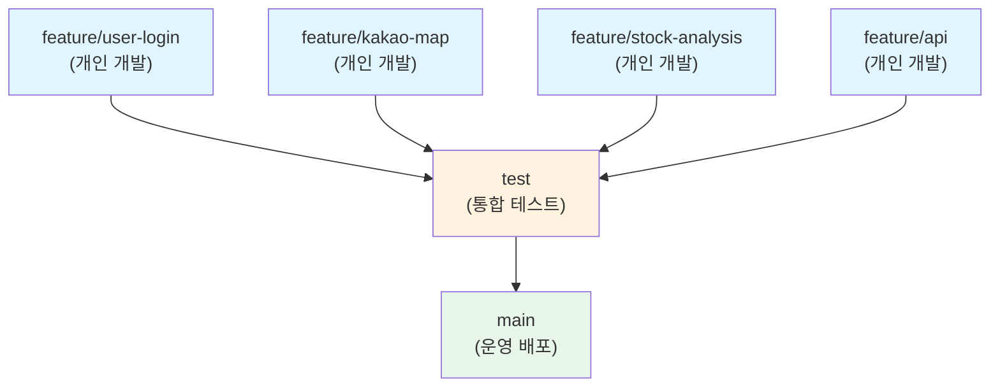
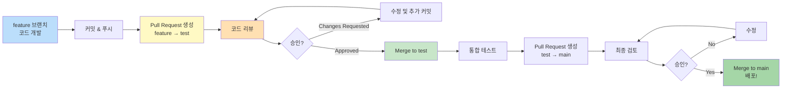
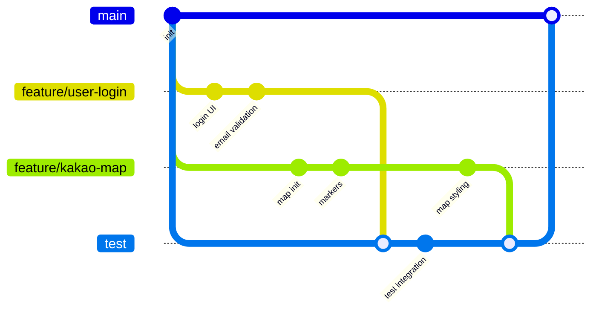
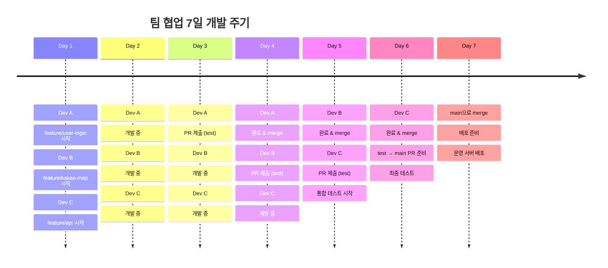
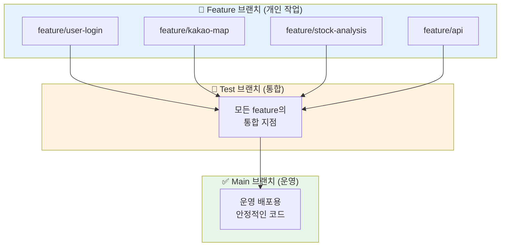
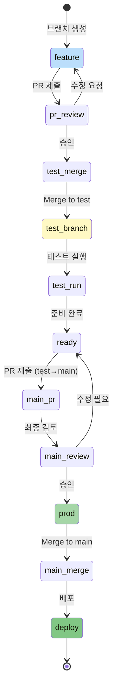
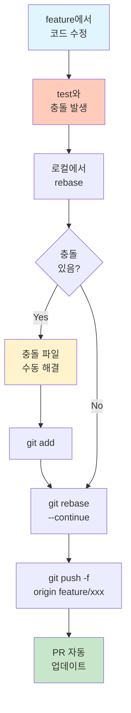
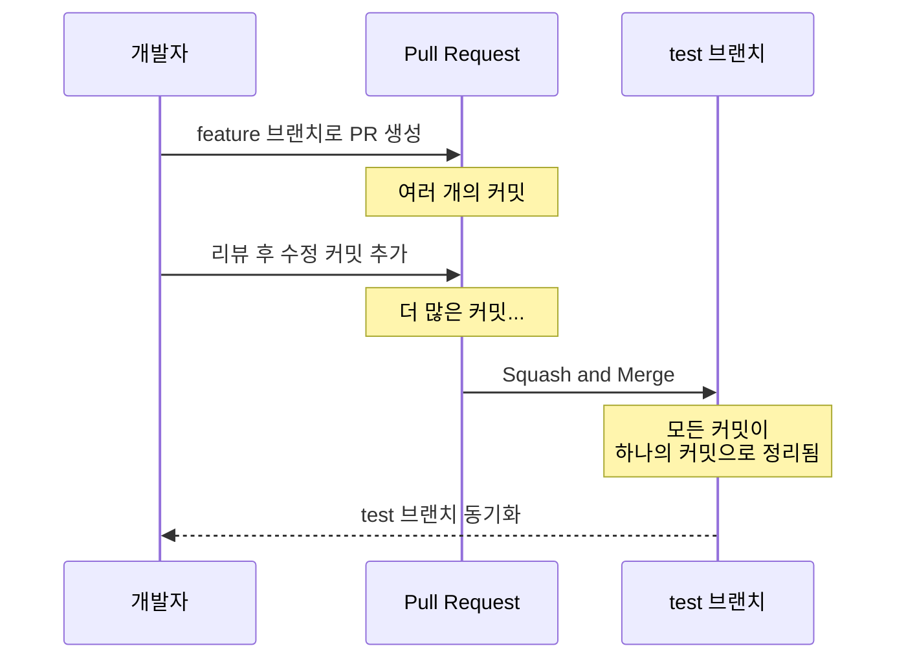

# GitHub Flow 시각화 다이어그램

## 🌳 브랜치 구조 (메인 흐름)

## 📊 Pull Request 워크플로우

## 🔄 동시 개발 시나리오

## ⏱️ 타임라인 (7일 개발 주기)

## 🎯 브랜치 역할 다이어그램

## 📋 상태 전환 다이어그램

## 🔀 충돌 해결 흐름

## 💡 권장 Squash Merge 흐름

---

**다이어그램 생성 도구:** Mermaid

이 다이어그램들은 마크다운 기반이므로 GitHub에서 직접 렌더링됩니다.
